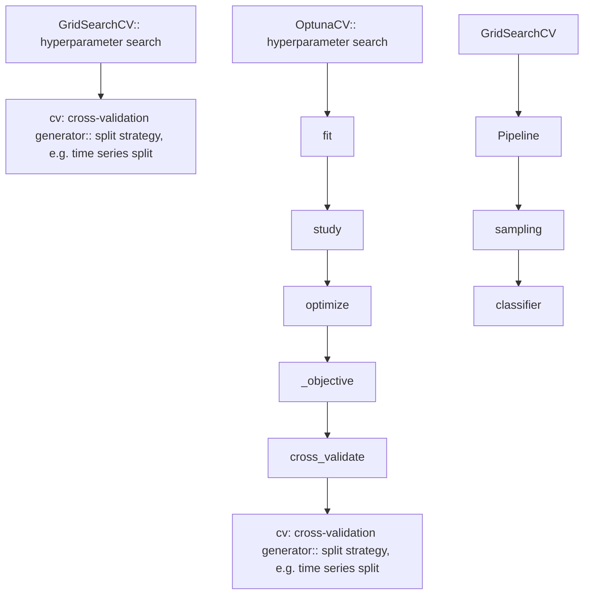

# learn-etc

Describe your project here.

# 
already compared get dummies
lets see how sklearn onehot behaves on polars and pandas

```mermaid
flowchart TD
    a[GridSearchCV:: hyperparameter search] --> b[cv: cross-validation generator:: split strategy, e.g. time series split]

    aa[OptunaCV:: hyperparameter search] --> fit --> study --> optimize --> _objective --> cross_validate --> bb[cv: cross-validation generator:: split strategy, e.g. time series split]

    aaa[GridSearchCV] --> bbb[Pipeline] --> ccc[sampling ] --> classifier
```
