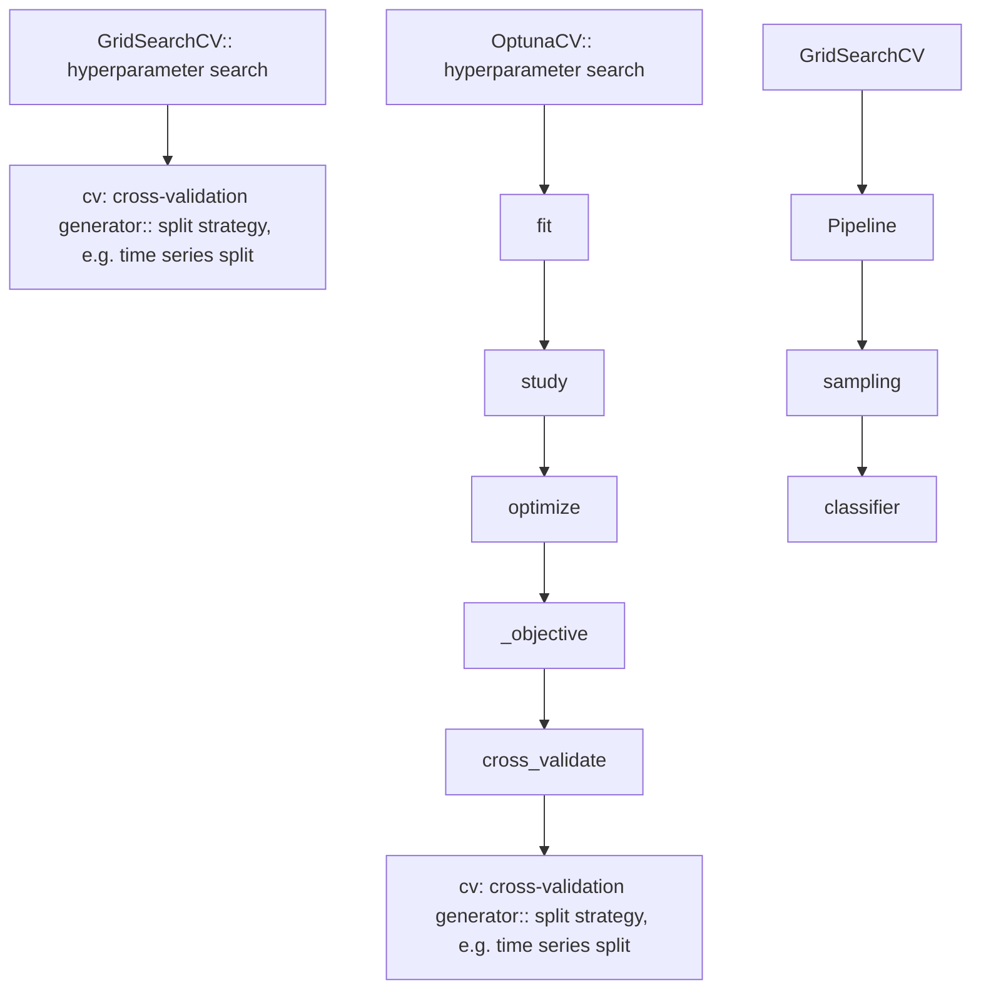

# learn-etc

Describe your project here.

# 
already compared get dummies
lets see how sklearn onehot behaves on polars and pandas

# optuna search:
 - The goal is originally to modify the `optuna_integration.sklearn.OptunaSearchCV` to be feasible to multi objective searchs such that there is a sklearn compatible module.
 - During research we also found this wrapper with similar intention: `ray.tune.search.optuna.OptunaSearch`
   - it support parametrized sampler, but maybe not pruner?  
 - ray tune can be integrated with mlflow to achieve experiment tracking.